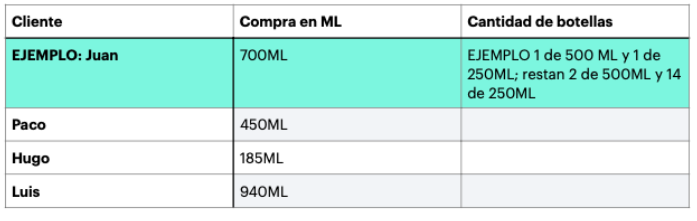

# Lógica general 
Describa brevemente como resolvería el siguiente problema en un programa de 
computadora. (Únicamente la descripción de qué es lo que haría usted, no lo 
programe). Sea lo más especifico posible.

En una tienda de productos de limpieza se venden detergentes líquidos por ML, y se 
tienen botellas de 100ML, 250ML, 350ML, 500ML. Hay cierta existencia de cada una de 
las botellas. 

| CAPACIDAD   | CANTIDAD  |
| ----------- | --------- |
|   100ML     |          7|
|   250ML     |         15|
|   350ML     |          5|
|   500ML     |          3|

1. ¿Qué haría usted para que cuando un cliente compre algún producto se utilicen 
la menor cantidad de botellas, y se desperdicie la menor cantidad de espacio en 
las mismas.?

2. Plasme la descripción de su algoritmo.

3. Ejemplifique cómo distribuiría el liquido en los contenedores de la tabla de arriba 
con las siguientes compras ficticias, siguiendo su propuesta.

Puntos extras:
- Si presenta pruebas de escritorio de su algoritmo. 
