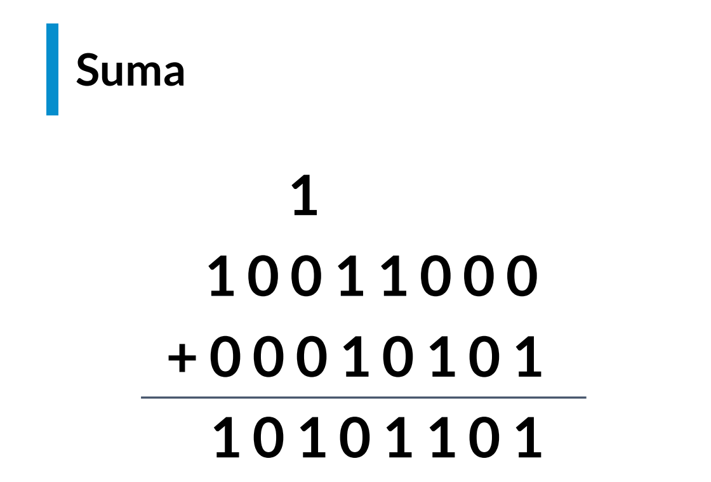

# Pensamiento logico

---

# ¿Por qué es importante entrenar tu pensamiento lógico?

---

# ¿Alguna vez has pensado cómo optimizar las tareas de tu vida diaria?

---

# Tomar la ruta más corta

---

# Usar la mitad del tiempo en tu rutina

---
# Nuestro objetivo

Entender que puedes encontrar
soluciones óptimas a problemas simples
y complejos.

---

# El Sistema Binario
# 100101011001

---

---

---

# Convertir 34 a binario

## 34 / 2 = 17 (queda 0)

---

# Convertir 34 a binario

## 34 / 2 = 17 (queda 0)
## 17 / 2 = 8 (queda 1)

---

# Convertir 34 a binario

##  34 / 2 = 17 (queda 0)
## 17 / 2 = 8 (queda 1)
## 8 / 2 = 4 (queda 0)

---

# Convertir 34 a binario

## 34 / 2 = 17 (queda 0)
## 17 / 2 = 8 (queda 1)
## 8 / 2 = 4 (queda 0)
## 4 / 2 = 2 (queda 0)

---

# Convertir 34 a binario

## 34 / 2 = 17 (queda 0)
## 17 / 2 = 8 (queda 1)
## 8 / 2 = 4 (queda 0)
## 4 / 2 = 2 (queda 0)
## 2 / 2 = 1 (queda 0)

---

# Convertir 34 a binario

## 34 / 2 = 17 (queda 0)
## 17 / 2 = 8 (queda 1)
## 8 / 2 = 4 (queda 0)
## 4 / 2 = 2 (queda 0)
## 2 / 2 = 1 (queda 0)
## 1 / 2 = 0 (queda 1)

---

---

# 34 = 100010

---

# Operaciones Aritméticas

--- 

## Suma

# 0 + 0 = 0

# 0 + 1 = 1

# 1 + 0 = 1

# 1 + 1 = 10

---

---

## Resta

# 0 - 0 = 0

# 1 - 0 = 1

# 1 - 1 = 0

# (1)  0 - 1 = 1

---

---

# Multiplicación y División

---

# Reto:

# Traduce el año actual menos tu edad para encontrar el año en que naciste